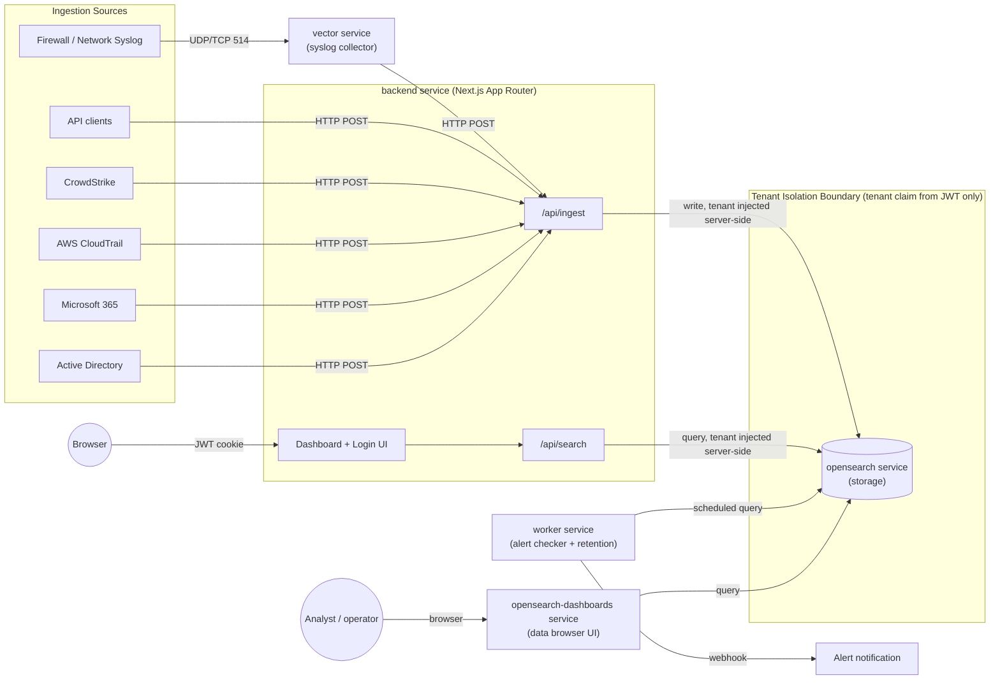

# Architecture Documentation

## System Overview
Log Management Demo is a full-stack application for collecting, normalizing, storing, and analyzing log data from multiple sources.

## Architecture Diagram

This diagram shows all 5 `docker-compose` services (`backend`, `vector`, `opensearch`, `worker`,
`opensearch-dashboards`), the 7 ingestion sources funneling into `POST /api/ingest` (syslog via
Vector, the other 6 as direct HTTP POST), and the tenant isolation boundary around OpenSearch —
every read/write into that boundary is scoped by the `tenant` claim from the JWT, never by
client-supplied input. See "Tenant Model" below for the detailed explanation, and "Deployment Modes"
for how this same set of services differs between Appliance and SaaS.

Note: `opensearch-dashboards` is an operator-facing data browser for raw index inspection, separate
from the tenant-scoped application `UI`. It queries OpenSearch directly with no tenant filter, so it
is intended for local/demo use by whoever operates the stack, not for end users of the multi-tenant
application.

## Tenant Model

Every user's JWT payload (`TokenPayload` in `backend/src/lib/auth.ts`) carries a `tenant` field
assigned at login time from the user record (e.g. `admin@demoA` → `tenant: "demoA"`). This field is
the **single source of truth** for tenant scoping across the whole system:

- **Ingest**: `backend/src/app/api/ingest/route.ts` calls `requireRole(request, ["admin"])`, then
  reads `user.tenant` from the verified token and merges it into the log object being normalized and
  indexed — the tenant is never read from the request body.
- **Search**: `backend/src/app/api/search/route.ts` reads `payload.tenant` from the verified token
  and passes it into `searchLogs()` (`backend/src/lib/opensearch.ts`), which adds
  `{ term: { tenant } }` as a mandatory clause in every OpenSearch query — a query can never return
  logs from another tenant regardless of what a client sends.
- **Alert reads**: `backend/src/app/api/alerts/route.ts` passes `user.tenant` into `getPersistedAlerts(tenant)`, which adds the tenant clause to the `alerts` index query — a user only ever sees alerts belonging to their own tenant. The worker evaluates rules per tenant (`listTenants()`), and each stored `AlertEvent` records its `tenant`.
- **No override path**: neither route accepts a `tenant` query param or body field for this purpose;
  even if a client includes one, it is ignored because the value used server-side always comes from
  `requireAuth`/`requireRole`'s decoded JWT, not from `request.json()`/`searchParams`.

This means tenant isolation is enforced structurally at the two chokepoints (ingest write, search
read) rather than relying on every caller to remember to filter correctly.

## Technology Stack
- **Frontend + Backend**: Next.js 14+ (App Router), TypeScript, Tailwind CSS
- **Log Collector**: Vector (syslog ingestion)
- **Storage/Search**: OpenSearch
- **Authentication**: JWT (via jose/jsonwebtoken), bcrypt
- **Validation**: Zod
- **Charts**: Recharts
- **Deployment**: Docker Compose

## Components

### Backend API (`/backend/src/app/api/`)
- `api/auth/login` - User authentication, returns JWT
- `api/auth/me` - Verify current user/token
- `api/auth/logout` - Clear session
- `api/ingest` - Accept and normalize logs from all sources (single object or `{ logs: [...] }` batch)
- `api/search` - Search logs with tenant isolation
- `api/alerts` - View alert history (tenant-scoped via JWT)
- `api/alert-rules` - Manage alert rules; `GET` for admin+viewer, `POST`/`PATCH`/`DELETE` admin-only
- `api/users` - User Management CRUD, admin-only, tenant-scoped
- `api/reset` - Admin-only "Reset System Data" (wipes `logs` + `alerts`)

### Source Normalizers (`/backend/src/lib/normalizers/`)
- `firewall.ts` - Firewall/syslog normalization
- `api.ts` - HTTP API log normalization
- `crowdstrike.ts` - CrowdStrike Falcon normalization
- `aws.ts` - AWS CloudTrail normalization
- `m365.ts` - Microsoft 365 Defender normalization
- `ad.ts` - Active Directory normalization
- `network.ts` - Generic network/syslog normalization

### Syslog Parser (`/backend/src/lib/syslog.ts`)
- Parses RFC 5424 format syslog messages
- Extracts key=value pairs from syslog messages
- Converts to normalized log format

### OpenSearch Client (`/backend/src/lib/opensearch.ts`)
- Index management with schema mapping
- Log indexing with tenant field
- Search with tenant filtering
- Data retention via deleteByQuery (`deleteOldLogs`) and full wipe for demo reset (`deleteAllLogsAndAlerts`)

### OpenSearch Indices
| Index | Written by | Purpose |
|---|---|---|
| `logs` | `indexLog()` | Normalized log documents (all sources/tenants) |
| `alerts` | `alerting.ts` | Triggered alert events (explicit mapping, `tenant` keyword) |
| `alert_rules` | `alertRulesStore.ts` | Alert rule configs (live-editable via UI) |
| `alert_state` | `alertDedup.ts` | Per `(tenant, rule, group)` `last_triggered_at` for cooldown/dedup (best-effort; fails open) |
| `users` | `users.ts` | User accounts (bcrypt hashes, role, tenant) |

### OpenSearch Dashboards (`opensearch-dashboards` service, port 5601)
- Off-the-shelf data browser UI for the `logs` index (Discover, Dev Tools console)
- Not part of the application's own auth/tenant model — operator-facing only
- Runs as a standard `docker-compose` service alongside `opensearch`, no custom code

### Alerting System (`/backend/src/lib/alertRules.ts`, `alertRulesStore.ts`, `ruleAggregation.ts`, `tenants.ts`, `alertDedup.ts`, `webhookDispatch.ts`, `alerting.ts`, `/backend/workers/alertChecker.ts`)
- Rules are config objects (field to match, group-by field, threshold, time window, cooldown, severity, optional `webhook_url`) — adding a rule needs no new detection code
- **Rules are managed live via the web UI** (`/dashboard/alert-rules`, admin-only) backed by a dedicated `alert_rules` OpenSearch index (`alertRulesStore.ts`) — create, edit, enable/disable, and delete rules without touching code or redeploying; the worker reads the current rules from the store on every cycle, so changes apply on the next run automatically
- **Detection runs as an OpenSearch aggregation, not in-memory counting** — `findRuleGroups()` (`ruleAggregation.ts`) issues a single `size: 0` `terms` aggregation with `min_doc_count = threshold` over a `bool.filter` of `{term tenant}` + `{term matchField: matchValue}` + a `@timestamp` range, returning `{ group, count }[]`. This replaced the earlier "fetch the latest 100 docs and count in JS" approach, so results stay accurate at high volume
- **Multi-tenant by default** — `listTenants()` (`tenants.ts`) discovers tenants via a `terms` aggregation on the `logs` index; `alertChecker.ts` loops every tenant and evaluates the enabled rules per tenant. Each `AlertEvent` carries its `tenant`
- **Cooldown / dedup** — `shouldEmit(key, cooldownMs)` (`alertDedup.ts`) stores `last_triggered_at` per `(tenant, rule_id, group_value)` in the `alert_state` index and suppresses repeats until the cooldown elapses, preventing a continuously-firing condition from re-alerting every tick. It **fails open** (emits) if the state index is unavailable, so alerting never silently stops. Default cooldown (when a rule has no explicit `cooldown_minutes`) is `max(window_minutes, ALERT_CHECK_INTERVAL_MS)` (`alerting.ts`) — it can never be shorter than the rule's own time window, because `findRuleGroups()` re-aggregates the full window on every check and the same still-in-window logs would otherwise be re-counted and re-alerted on every worker tick even with no new matching logs. Set an explicit `cooldown_minutes` on a rule to suppress repeats even longer than its window
- **Per-rule webhook** — `dispatchWebhook(alert, rule.webhook_url)` (`webhookDispatch.ts`) posts to the rule's own URL, falling back to the global `WEBHOOK_URL` env var; delivery errors are swallowed and never disrupt evaluation
- Background worker (`alertChecker.ts`) runs on a fixed interval, `ALERT_CHECK_INTERVAL_MS` (`alerting.ts`, default 10000ms, overridable only via the `ALERT_CHECK_INTERVAL_MS` env var — **not** editable at runtime from the UI, by design, to avoid accidental re-alert storms from lowering it below a rule's time window): discovers tenants, calls `evaluateAllRules(tenant)` for each, and persists triggered alerts to the `alerts` OpenSearch index
- `GET /api/alerts` is tenant-scoped via `getPersistedAlerts(tenant)`; the frontend polls it every 5s and shows new alerts as toast popups plus an unread-count bell badge, in addition to the Alerts history page

### Authentication (`/backend/src/lib/auth.ts`)
- JWT token generation and verification
- bcrypt password hashing
- RBAC (admin/viewer roles) enforced via `requireRole()` at the API layer, not just hidden in the UI
- Tenant-based authorization — `tenant` is always read from the JWT payload, never from client input

### RBAC-Visible Feature: User Management (`/backend/src/lib/users.ts`, `/backend/src/app/api/users/route.ts`, `/backend/src/app/dashboard/users/page.tsx`)
- Admin-only page and API (`requireRole(request, ["admin"])`) — viewers get a server-side redirect (page) or `403` (API), not just a hidden menu item
- Full CRUD: create user, change role, reset password, delete user — all persisted in a dedicated `users` OpenSearch index (`lib/users.ts`), so changes survive container restarts
- Tenant-scoped end to end: `listUsersInTenant(tenant)` filters by the caller's own tenant; create/update/delete all re-verify the target user's `tenant` matches the caller's before acting, so an admin in `demoA` can never view, edit, or delete a `demoB` user even by guessing an email
- New-user email is constrained to the admin's own tenant (`username@<own-tenant>`), enforced both in the UI (fixed suffix) and the API (400 if mismatched)
- Guardrails: cannot delete your own account, cannot demote or delete the last remaining admin in a tenant (prevents accidental lockout)
- Demonstrates both pillars of the AuthN/AuthZ requirement (role differentiation + tenant isolation) in one concrete, clickable feature

### System Reset (`/backend/src/app/api/reset/route.ts`)
- Admin-only, one-click "Reset System Data" button on the Dashboard — deletes all documents in both the `logs` and `alerts` indices (`deleteAllLogsAndAlerts()` in `opensearch.ts`) via `match_all` `deleteByQuery`, across every tenant
- Intended for demo/dev hygiene (clearing out accumulated sample data), not a tenant-scoped operation — requires explicit UI confirmation before firing
- Does not touch the `users` or `alert_rules` indices, so accounts and alert configuration survive a reset

## Data Flow
1. **Syslog**: Firewall → Vector (UDP 514) → Backend `/api/ingest` → OpenSearch
2. **HTTP API**: Client → Backend `/api/ingest` → Normalizer → OpenSearch
3. **Search**: Client → Backend `/api/search` → OpenSearch query → Tenant filter → Response
4. **Alerting**: Worker → `listTenants()` → per-tenant `findRuleGroups()` (OpenSearch `terms` aggregation) → `shouldEmit()` cooldown check (`alert_state`) → `persistAlert()` (`alerts` index) → `dispatchWebhook()` (rule `webhook_url` or `WEBHOOK_URL`)

## Security
- All log searches enforce tenant isolation from JWT
- Tenant field cannot be overridden by client query parameters
- JWT tokens stored as httpOnly cookies
- Role-based access control on all endpoints

## Deployment Modes
The same 5 services shown in the Architecture Diagram above run unchanged in both modes — only the
network edge differs:
- **Appliance**: `docker compose up -d` (single machine), services reachable directly on their
  compose ports (`backend:3000`, `opensearch:9200`, `vector:514`), no TLS termination.
- **SaaS**: Same `docker compose` stack deployed to a cloud VM, fronted by a Caddy reverse proxy that
  terminates TLS and forwards to the `backend` service; `vector` still accepts external syslog on its
  own port. Only `.env` differs between the two modes, not the compose topology.

## Repository Structure Rationale — no `/frontend/` folder

The assignment's suggested layout (section 6.1) lists `/frontend/` and `/backend/` as separate
top-level folders. This project intentionally merges both into a single `/backend/` Next.js App
Router project instead: `backend/src/app/dashboard/*` and `backend/src/app/login/*` serve the UI,
while `backend/src/app/api/*` serves the API, from the same codebase. This lets the UI and API share
types, `lib/auth.ts`, and validation schemas directly with no network hop or duplicated schema
definitions between two projects. This was a deliberate architecture choice made possible by Next.js
App Router's ability to colocate frontend and backend code, not an oversight or missing deliverable.
